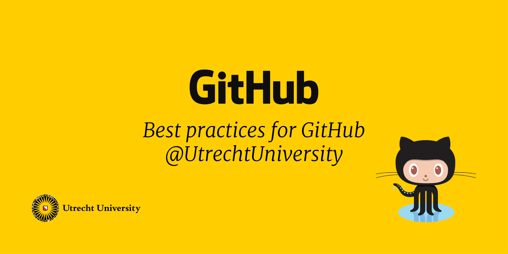

# Best practices

Welcome at the best practices for git, research software development, and research data management. This repository was created for and by researchers and support staff of Utrecht University. The community is strongly encouraged to share best practices in this repository. 

## Topics

### Using Git and Github

Git is free and open-source software for version management. It was created in the 2005 and is nowadays the facto-standard version control software for software development. GitHub is an online service based on Git that makes it easy to work together and share your work openly. It can also be used as a backup of your local work. Learning Git and GitHub can be steep in the beginning, but will be worth all the effort. 

**Quick start**

1. [Create GitHub Account](https://github.com/join)
2. [Download and install GitHub Desktop](https://desktop.github.com/)
3. [Authenticate GitHub for Utrecht University](https://github.com/UtrechtUniversity/getting-started) [OPTIONAL]
4. [Create your first repository with Github Desktop](https://docs.github.com/en/desktop/installing-and-configuring-github-desktop/overview)

**Read more**

- [Git vs Github – Demystifying The Differences](https://www.edureka.co/blog/git-vs-github/)
- [Learn how to use GitHub with interactive courses designed for beginners and experts](https://skills.github.com)
- [Version Control with Git by The Carpentries](https://swcarpentry.github.io/git-novice/)
- [RDM course: Best Practices for Writing Reproducible Code](https://www.uu.nl/en/research/research-data-management/training-workshops/best-practices-for-writing-reproducible-code)

### FAIR Software

The [FAIR principles](https://www.nature.com/articles/sdata201618) are a framework that is widely used in research data management. The acronym stands for Findable, Accessible, Interoperable and Reusable. Recently, the FAIR principles are applied to [research software](https://content.iospress.com/articles/data-science/ds190026) by Anna-Lena Lamprecht et al (2020). 

**Quick start**

- [Five Recommendations for FAIR Software](https://fair-software.eu/)

**Tools**

- [Python package to analyze a GitHub or GitLab repository's compliance with the fair-software.eu recommendations](https://github.com/fair-software/howfairis)

**Read more**

- Paper on FAIR software principles: [Towards FAIR principles for research software (Lamprecht et al, 2020)](https://content.iospress.com/articles/data-science/ds190026)
- Paper on FAIR data principles: [The FAIR Guiding Principles for scientific data management and stewardship](https://www.nature.com/articles/sdata201618)
- Working group *FAIR for Research Software (FAIR4RS)* https://www.rd-alliance.org/groups/fair-research-software-fair4rs-wg

### Visibility

To facilitate reuse of your wonderful work, people should be able to find you and your work. GitHub offers a lot of options to make your research software more visible. 

**Quick start**

- Add a [bio and profile README to your GitHub account](https://docs.github.com/en/github/setting-up-and-managing-your-github-profile/customizing-your-profile/about-your-profile) 
- Add GitHub profile to [your staff page](https://www.uu.nl/staff/)
- Add [topics](https://docs.github.com/en/github/administering-a-repository/managing-repository-settings/classifying-your-repository-with-topics) to your repository to increase findability https://github.com/topics. There is also topic for [`#utrecht-university`](https://github.com/topics/utrecht-university).

**Read more**

- [Utrecht University Visibility To-Do List](https://www.uu.nl/en/university-library/advice-support-to/researchers/visibility/research-visibility-check/visibility-to-do-list)
- Use [Github Pages](https://pages.github.com/) to publish a project overview and link to all relevant repositories and collaborators

## Contributing

Contributions to this repository are very welcome. The main idea of this repository is to have a collection of good practices tailored to researchers at Utrecht University. 

The following contribution guidelines apply to this repository: 

- Open a Pull Request or file an Issue if you have anything to add, change, or delete. 
- Browse the [issue with label Help Wanted](https://github.com/UtrechtUniversity/best-practices/issues?q=is%3Aissue+is%3Aopen+label%3A%22help+wanted%22) to see what you can contribute 
- Create a new topic if necessary. 
- Use an editorial style guide for writing, preferably the [Google developer documentation style guide](https://developers.google.com/style). 

## License

The content in this repository is licensed [CC0-1.0](/LICENSE) (release to the public domain).

## Contact

This repository is currently maintained by the [Utrecht University Open Science Programme](https://www.uu.nl/en/research/open-science), and the ITS department. Are you an Utrecht University researcher or support staff and willing to help maintaining this repository? Reach out to its.ris@uu.nl. 
